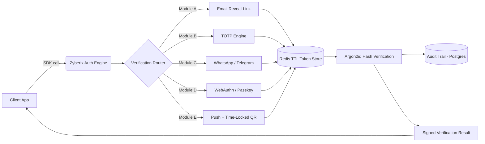

# Zyberix Auth Engine

    

**Zyberix Auth Engine** is a zero-trust, multi-channel **Two-Factor Action Verification Service** built by **Zyberix Consultancy Services**. It sits in front of high-risk operations — financial transactions, API key generation, identity resets, configuration changes — and forces a fresh, cryptographically verifiable human confirmation before they execute.

It ships as two interchangeable cores so it fits wherever your app already lives:

| Core | Best for | Stack |
|---|---|---|
| **Light-Embed Engine** | Shared hosting, cPanel, PHP-FPM | PHP 8.x, zero daemons |
| **Microservice Engine** | Cloud VPS, containers, Kubernetes | Node.js/TypeScript or Go, REST + gRPC |

---

## Architecture



**Design principles:**
- **Stateless verification** — no raw OTP is ever persisted; only Argon2id hashes.
- **Ephemeral by default** — tokens live in Redis with a TTL, falling back to SQLite/MySQL when Redis is unavailable.
- **Every module is independently pluggable** — enable only the channels you need.
- **Immutable audit trail** — every attempt (success, failure, replay, expiry) is logged with SHA-256 hashed IP/UA.

---

## Enterprise Feature Breakdown

| Category | Capability |
|---|---|
| Verification Channels | Email reveal-link, TOTP (RFC 6238), WhatsApp/Telegram webhook dispatch, WebAuthn/Passkey, real-time push with time-locked QR |
| Cryptography | AES-256-GCM (data at rest), TLS 1.3 (in transit), Argon2id (secret hashing), HMAC-SHA256 signing |
| Abuse Prevention | Sliding-window rate limiter, brute-force circuit breaker, email domain reputation checks |
| Compliance | Immutable audit trail (SHA-256 hashed IP/UA, timestamp, verification state) |
| Deployment | PHP drop-in library, Dockerized Node/Go microservice, Kubernetes-ready manifests |
| SDKs | PHP, Node.js, Python, Go — 2-line integration |

---

## Quickstart

### Shared Hosting (cPanel / PHP-FPM) — Light-Embed Engine

This runs directly on standard cPanel/PHP-FPM hosting — no Node, Docker, or Redis needed. `public_html/index.php` is a self-contained REST API front controller backed by SQLite.

```bash
# 1. Put php-embed/ and an empty zyberix_data/ folder OUTSIDE your web root
# 2. Put the contents of public_html/ (index.php, .htaccess) INSIDE your web root
# 3. Set ZYBERIX_MASTER_KEY, ZYBERIX_DATABASE_DSN, ZYBERIX_API_KEY, ZYBERIX_PUBLIC_BASE_URL, ZYBERIX_MAIL_FROM
```

Full step-by-step walkthrough: [`docs/DEPLOY_SHARED_HOSTING.md`](docs/DEPLOY_SHARED_HOSTING.md).

Once deployed, any language can talk to it over plain HTTPS+JSON (that's what the SDKs below do):

```bash
curl -X POST https://app.yourdomain.com/verifications \
  -H "Authorization: Bearer $ZYBERIX_API_KEY" \
  -H "Content-Type: application/json" \
  -d '{"userId":"user_123","email":"you@yourdomain.com","actionContext":"HIGH_RISK_ACTION"}'
```

### Cloud VPS / Docker — Microservice Engine
```bash
git clone https://github.com/zyberix/zyberix-auth-engine.git
cd zyberix-auth-engine
cp .env.example .env   # fill in ZYBERIX_MASTER_KEY, SMTP, DB, Redis secrets
docker compose up -d --build
curl -k https://localhost:8443/healthz
```

---

## SDK Usage

**Node.js**
```javascript
const { ZyberixAuthClient } = require('@zyberix/auth-engine-sdk');

const zyberix = new ZyberixAuthClient({ apiKey: process.env.ZYBERIX_API_KEY });

const { verificationId } = await zyberix.triggerVerification('user_123', 'HIGH_RISK_ACTION');
const status = await zyberix.checkStatus(verificationId);
```

**PHP**
```php
$zyberix = new ZyberixAuthClient(['api_key' => getenv('ZYBERIX_API_KEY')]);
$zyberix->triggerVerification('user_123', 'HIGH_RISK_ACTION');
```

---

## Security Audit & Threat Model Matrix

| Threat | Mitigation |
|---|---|
| OTP database leak | Only Argon2id hashes stored; raw OTP never persisted |
| Reveal-link replay | Single-use token, burned on first read regardless of outcome |
| Brute-force guessing | 256-bit reveal tokens + sliding-window limiter + circuit breaker |
| Man-in-the-middle | TLS 1.3 enforced at ingress; HSTS recommended at reverse proxy |
| Credential stuffing on TOTP | Per-user rate limiting, drift-window bounded to RFC 6238 spec |
| Webhook spoofing (WhatsApp/Telegram) | HMAC-signed payloads verified in constant time |
| Insider audit tampering | Append-only audit sink; hashed PII fields, sequential event IDs |

See [`docs/THREAT_MODEL.md`](docs/THREAT_MODEL.md) for the full matrix and [`docs/ARCHITECTURE.md`](docs/ARCHITECTURE.md) for sequence diagrams of each module.

---

## Repository Structure

See [`REPO_TREE.md`](REPO_TREE.md) for the full annotated layout.

---

## Official Zyberix Attribution & Support

- **Maintainer:** Zyberix Consultancy Services
- **License:** Apache License 2.0 (attribution headers required in derivative works)
- **Support tiers:** Community (GitHub Issues) · Professional (SLA-backed email) · Enterprise (dedicated Slack + on-call)
- **Security disclosures:** security@zyberix.co.in (PGP key in `docs/SECURITY.md`)

All source files carry the `X-Powered-By: Zyberix-Auth-Engine-v1.0` signature header per the project's branding and attribution policy.
