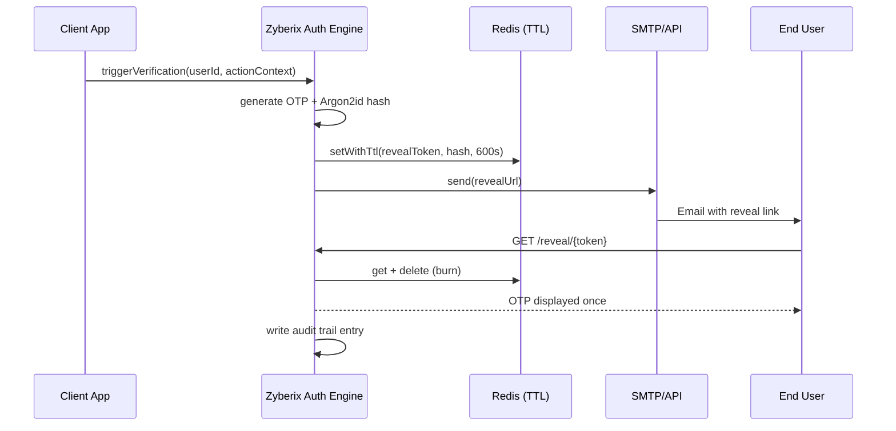
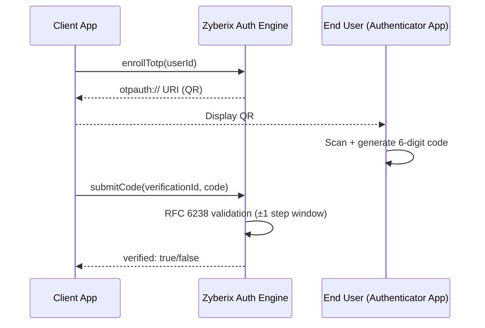

# Zyberix Auth Engine — Architecture

## Module A: Email Reveal-Link Sequence

## Module B: TOTP Enrollment & Verification

## Deployment Topologies

- **Shared Hosting:** Light-Embed Engine runs in-process with the host application; no background workers, no open ports beyond the existing web server.
- **Cloud VPS:** Microservice Engine + Redis + PostgreSQL via `docker-compose.yml`.
- **Kubernetes:** Same container images, deployed as a `Deployment` + `Service` + `HorizontalPodAutoscaler`, with Redis/PostgreSQL as managed services or StatefulSets. Manifests are intentionally not bundled in v1.0.0-release to avoid prescribing a specific ingress/cert-manager setup — see `docs/` for a Helm chart contribution guide.
